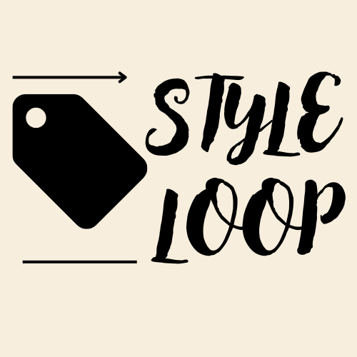

<!-- PROJECT SHIELDS -->

<!-- PROJECT LOGO -->
 

  
  <h3 align="center">Style Loop</h3>
  

    🎉 Welcome to Style Loop, your go-to online store for trendy men's and women's clothing. Our responsive and user-friendly platform is designed to provide a seamless and enjoyable shopping experience for the youth.
     

  

<!-- TABLE OF CONTENTS -->

  
Table of Contents

  <ol>
    <li><a href="#about">About</a></li>
    <li><a href="#features">Features</a></li>
    <li><a href="#products">Products</a></li>
    <li><a href="#tech-stack">Tech Stack</a></li>
    <li><a href="#installation-and-setup">Installation and Setup</a></li>
    <li><a href="#usage">Usage</a></li>
    <li><a href="#contact">Contact</a></li>
  </ol>

<!-- ABOUT THE PROJECT -->
About
Style Loop offers a wide range of clothing options for both men and women, including shirts, t-shirts, jeans, tops, and dresses. We aim to enhance your online shopping experience with modern, stylish designs and a user-friendly interface.
 
<!-- FEATURES -->
Features 
🌠Responsive Design: Developed with HTML, CSS, and Bootstrap to ensure compatibility across various devices and browsers. 
⚡ Dynamic Content Rendering: Utilized JSON and jQuery for seamless content updates and interactive features. 
🛒 Interactive Elements: Includes product filters and a shopping cart for an engaging shopping experience. 
🨠Visually Appealing Layouts: Designed with modern design principles to create a visually appealing and user-friendly interface.  

<!-- PRODUCTS -->
Products 
👕 Men's Clothing: Shirts, T-Shirts, Jeans 
👗 Women's Clothing: Tops, Dresses, T-Shirts, Jeans 
 
<!-- TECH STACK -->
Tech Stack 
Frontend: HTML5, CSS3, Bootstrap 4/5 
Interactivity: JavaScript, jQuery 
Data Handling: JSON 
Version Control: Git/GitHub 

<!-- INSTALLATION AND SETUP -->
<h2>Installation and Setup</h2>

To set up the project locally, follow these steps:

1. Clone the repository: 
<code>git clone https://github.com/yourusername/your-repo-name.git</code>  

2. Navigate to the project directory: 
<code>cd your-repo-name</code>  

3. Open the index.html file in your preferred web browser: 
<code>open index.html</code>

Usage 
Once the project is set up, you can explore the following features: 

🛍️ Browse through different categories of men's and women's clothing. 
🔠Use the product filters to find items based on your preferences. 
🛒 Add items to the shopping cart and proceed to checkout. 

<!-- CONTACT -->
Contact
For support or inquiries, please contact us at:

Email: prashantyadav2069@gmail.com
 
Project Link: https://prashant2087.github.io/Style-Loop/

<!-- MARKDOWN LINKS & IMAGES -->
